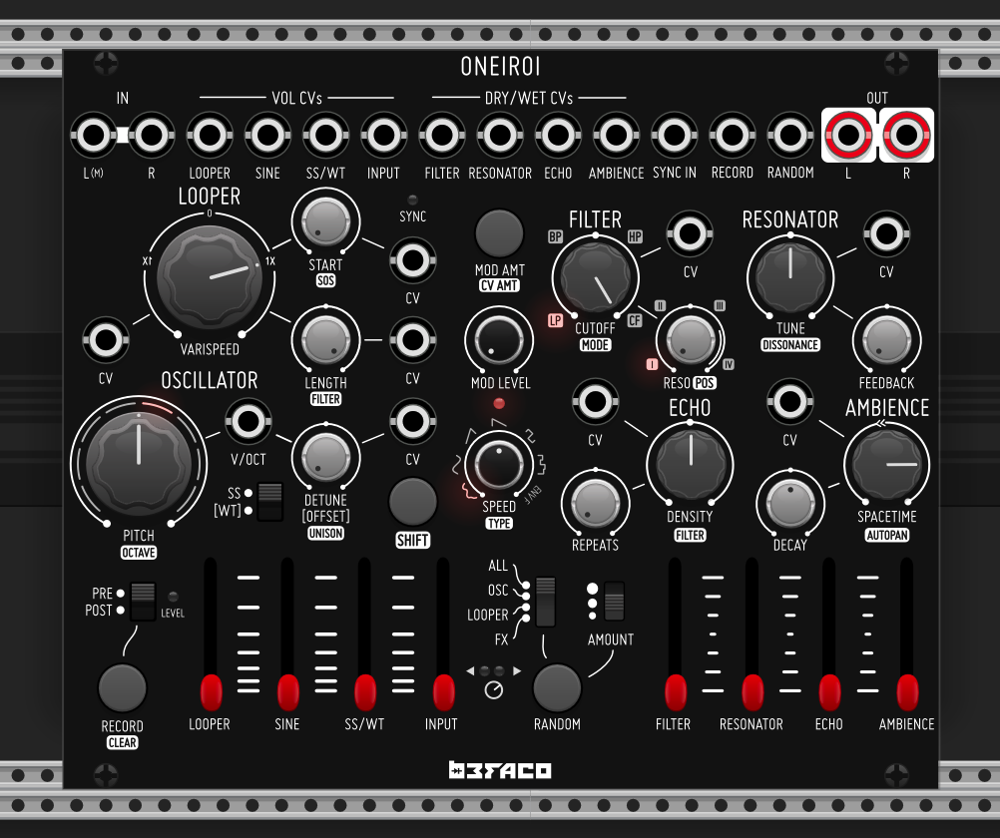

# Befaco Oneiroi

Based on [Befaco Oneiroi](http://www.befaco.org/oneiroi) Eurorack module. For the official manual, see [here](https://befaco.org/docs/Oneiroi/Oneiroi_User_Manual.pdf).

## Differences with hardware

* Randomisation can optionally be applied to every parameter using the built in VCV randomisation
* Input gain switch (available on hardware) has been removed as this makes no sense in VCV
* Undo/redo is natively handled by VCV Rack
* .wav files can be loaded from the context menu (naive loading no sample rate conversion!)
* Additional LED indicators have been added for filter type, filter position, modulation type and oscillator octave
* Distinct virtual knobs are used for each parameter so parameter catch-up (used on hardware) is not needed. 
* As yet, slew of parameter values on randomize is not supported

